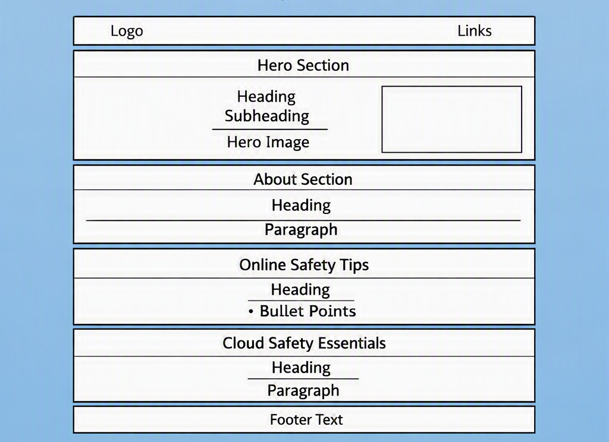

# Cloud Safety Awareness

## Overview
Cloud Safety Awareness is a one-page educational website designed to help everyday users understand how to stay safe online in a cloud-driven world. The site explains cloud safety in simple, accessible language and provides practical tips for protecting personal data, avoiding digital risks, and using online services responsibly. The goal is to promote safeguarding, digital wellbeing, and safer online behaviour.

---

## User Stories

- As a user, I want to understand what cloud safety means so that I can use online services confidently.
- As a user, I want simple explanations so that I can learn without needing technical knowledge.
- As a user, I want tips to protect my data so that I can stay safe online.
- As a user, I want to recognise unsafe websites so that I can avoid digital risks.

---
## Wireframes
The wireframe below shows the website layout.

## Deployment

The project was deployed using GitHub Pages.

### Deployment Steps
1. Open the repository on GitHub.
2. Go to **Settings**.
3. Navigate to **Pages**.
4. Under **Source**, select **Deploy from a branch**.
5. Choose the **main** branch and the **/(root)** folder.
6. Save the settings and wait for GitHub Pages to build the site.

### Live Site
The project is now live and accessible at:

https://satapathysangita.github.io/cloud-safety-awareness/

The site is served over HTTPS automatically by GitHub Pages.

## Project Progress

### Completed Tasks
- Repository created and initial structure set up.
- README file created with all required sections.
- GitHub Project Board created (Todo / In Progress / Done).
- Navbar built and styled.
- Hero section completed with gradient background and cloud image.
- Three main content sections added:
  - What is Cloud Safety?
  - Online Safety Tips
  - Cloud Safety Basics
- Footer added and styled.
- Cloud image added with alt text for accessibility.
- Full CSS styling completed.
- Project successfully deployed to GitHub Pages (HTTPS).

### Next Steps
- Add mobile responsiveness (media queries).
- Improve spacing and layout for smaller screens.
- Perform testing (DevTools, Lighthouse, HTML/CSS validators).
- Finalise README with testing results and screenshots.

## Testing

### HTML Validation
The W3C HTML Validator was used to test index.html.  
The page passed without errors.  
(Screenshot included below)

### CSS Validation
The W3C CSS Validator was used to test style.css.  
The stylesheet passed without errors.  
(Screenshot included below)

### Lighthouse Report
A Lighthouse audit was run in Chrome DevTools for mobile.  
Scores were acceptable for Performance, Accessibility, Best Practices, and SEO.  
(Screenshot included below)

### Manual Testing
**Navigation**
- All navbar links were clicked and confirmed to scroll to the correct sections.
- No broken links found.

**Responsiveness**
- Website tested on desktop, tablet, and mobile screen sizes.
- Text remains readable on all devices.
- Images resize correctly without distortion.
- No horizontal scrolling on mobile.

**Content**
- All images load correctly.
- All text is visible and properly spaced.
- No overlapping elements.

### Bugs
No major bugs found during testing.  
Minor spacing adjustments were made during development.

